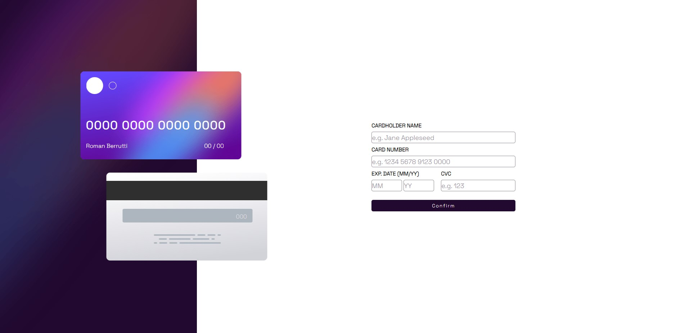
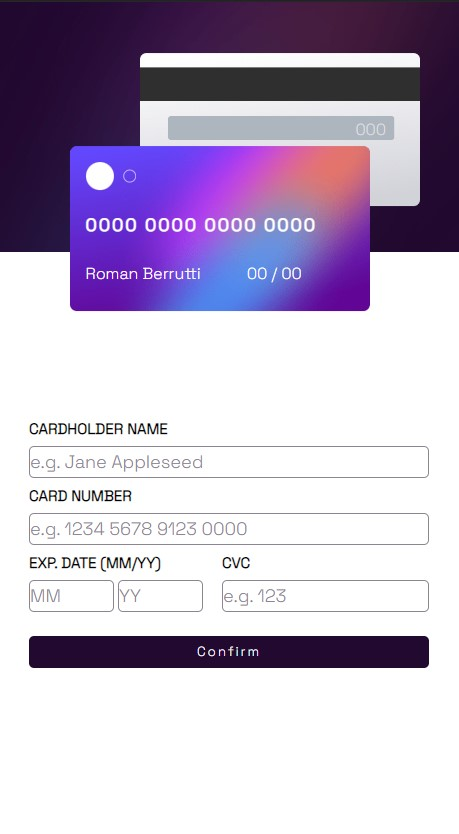

## Welcome 👋👋

# Article Preview

*This was a project that caught my attention because of its beauty and because it contained Js material that I had never seen before, which is mainly why I chose it. When it was time to start I could make a mockup in my head of how I had both the css and the functions I was going to use. The development of the site was going quite well until I finished the desktop version and had to develop the responsive version. Here it really got complicated*

### I used

*   DOM Management
*   Dynamic style change
*   Real-time listening event

